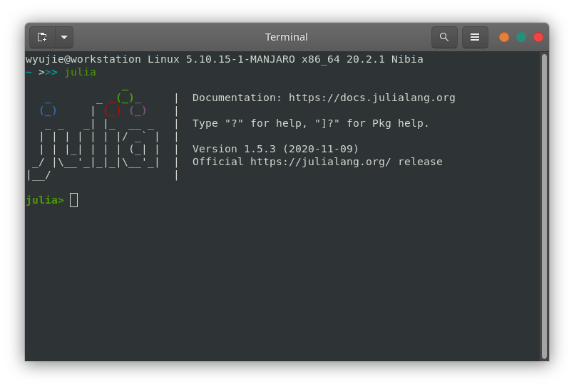
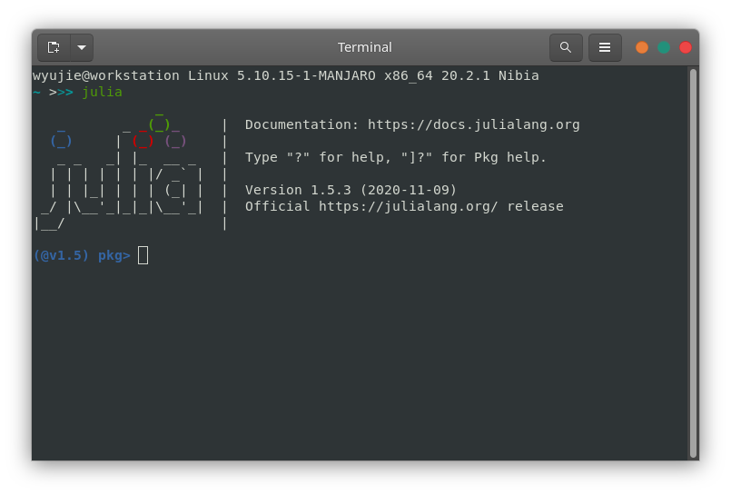
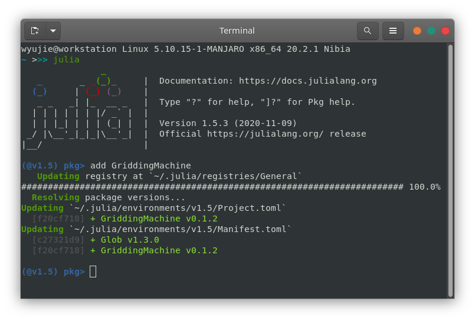
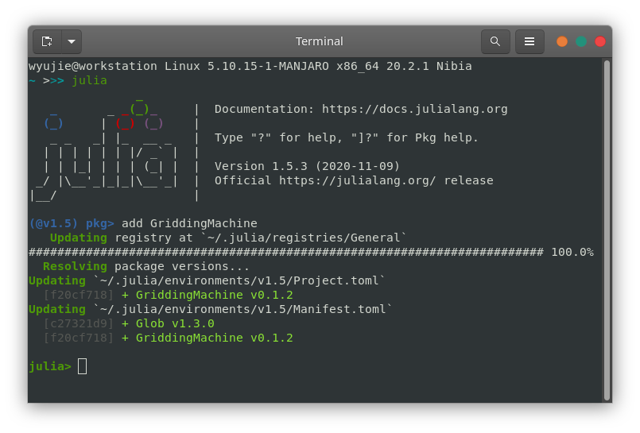
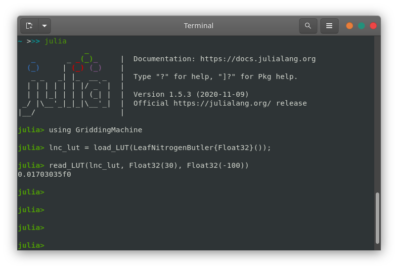

# METHODS

## Vegetation canopy model complexity

Please contact Yujie Wang through [Github Issues](https://github.com/Yujie-W/PAGES/issues) if you find a mistake in this table or you want to add a new item to the list.

### Categories
- 1C-1BL
  - One canopy layer
  - One single big leaf without sunlit and shaded fractions
- 1C-1L
  - One canopy layer
  - One leaf without sunlit or shaded fractions (not big leaf!)
- 1C-2BL
  - One canopy layer
  - Two big leaves are categorized as sunlit and shaded fractions
- 1C-2L
  - One canopy layer
  - Two leaves for sunlit and shaded fractions (not big leaves!)
- KC-1L
  - Multilple canopy layer
  - One leaf without sunlit or shaded fractions for each layer (not big leaf!)
- KC-2L Multilple layer scheme with sunlit and shaded fractions
  - Multilple canopy layer
  - Two leaves for sunlit and shaded fractions per layer (not big leaves!)
- KC-IJL
  - Multiple canopy layers
  - Sunlit and shaded fractions per layer
  - Leaf angular distribution for sunlit fraction

### Models

|**Model**   |**Verion & Option**  |**Complexity**|**Reference**                                                        |**Documentation**         |
|:-----------|:--------------------|:-------------|:--------------------------------------------------------------------|:-------------------------|
| CliMA Land | 0.1 Default         | KC-IJL       | [Wang et al. (2021)](https://doi.org/10.5194/gmd-14-6741-2021)      |                          |
|            | 0.1 1X              | 1C-1L        | [Wang et al. (2021)](https://doi.org/10.5194/gmd-14-6741-2021)      |                          |
|            | 0.1 2X              | 1C-2L        | [Wang et al. (2021)](https://doi.org/10.5194/gmd-14-6741-2021)      |                          |
|            | 0.1 KX              | KC-1L        | [Wang et al. (2021)](https://doi.org/10.5194/gmd-14-6741-2021)      |                          |
|            | 0.1 2KX             | KC-2L        | [Wang et al. (2021)](https://doi.org/10.5194/gmd-14-6741-2021)      |                          |
| CLM        | 4.0                 | 1C-2L        | [Bonan et al. (2011)](https://doi.org/10.1029/2010JG001593)         | CLM 4.0 Tech Notes       |
|            | 4.5                 | 1C-2L        | [Lawrence et al. (2019)](https://doi.org/10.1029/2018MS001583)      | CLM 4.5 Tech Notes       |
|            | 5.0                 | 1C-2L        | [Lawrence et al. (2019)](https://doi.org/10.1029/2018MS001583)      | CLM 5.0 Tech Notes       |
|            | ml                  | KC-2L        | [Bonan et al. (2018)](https://doi.org/10.5194/gmd-11-1467-2018)     |                          |
| ISBA       | A-gs                | KC-2L        | [Carrer et al. (2013)](https://doi.org/10.1002/jgrg.20070)          |                          |
|            | MEB                 | KC-2L        | [Boone et al. (2017)](https://doi.org/10.5194/gmd-10-843-2017)      |                          |
| JULES      | 6.1 can\_rad\_mod 1 | 1C-1BL       | Jogireddy et al. (2006)                                             | JULES 6.1 User Guide     |
|            | 6.1 can\_rad\_mod 4 | KC-IJL       | [Clark et al. (2011)](https://doi.org/10.5194/gmd-4-701-2011)       | JULES 6.1 User Guide     |
|            | 6.1 can\_rad\_mod 5 | KC-2L        | [Clark et al. (2011)](https://doi.org/10.5194/gmd-4-701-2011)       | JULES 6.1 User Guide     |
|            | 6.1 can\_rad\_mod 6 | KC-2L        | [Clark et al. (2011)](https://doi.org/10.5194/gmd-4-701-2011)       | JULES 6.1 User Guide     |
| ORCHIDEE   | CAN v1              | KC-1L        | [Ryder et al. (2016)](https://doi.org/10.5194/gmd-9-223-2016)       |                          |
| SCOPE      | 1.7                 | KC-IJL       | [van der Tol et al. (2009)](https://doi.org/10.5194/bg-6-3109-2009) | SCOPE Documentation      |
|            | 2.0 lite off        | KC-IJL       | [Yang et al. (2021)](https://doi.org/10.5194/gmd-14-4697-2021)      | SCOPE Documentation      |
|            | 2.0 lite on         | KC-2L        | [Yang et al. (2021)](https://doi.org/10.5194/gmd-14-4697-2021)      | SCOPE Documentation      |
||||||

## GriddingMachine.jl v0.1

This tutorial is a bit out of data as the stable version of GriddingMachine is v0.2.

Preparation
- Julia (version 1.5+)
- Access to Github
- Access to ftp://fluo.gps.caltech.edu (to download data)

### Install GriddingMachine.jl
- Start Julia REPL (read-eval-print loop)
  
- Type `]` in the REPL, and goes to `pkg` environment
  
- Type `add GriddingMachine`
  
- Type `Backspace` to go back to Julia REPL
  

### Use GriddingMachine.jl
- Type `using GriddingMachine` in Julia REPL
  
- `lnc_lut = load_LUT(LNCButler{Float32}());`
- `read_LUT(lnc_lut, Float32(30), Float32(-100))`
  
- Be aware that provided lat and lon need to be the same float type as the dataset, either Float32 or Float64

### Upgrade GriddingMachine.jl
- Start Julia REPL (read-eval-print loop)
- Type `]` in the REPL, and goes to `pkg` environment
- Type `up` to upgrade all Julia packages
- Type `up GriddingMachine` to upgrade GriddingMachine only
  

## Relative leaf water content

Equipments and materials required:
- Plastic zip bags
- Oven proof envelopes
- Scissors
- Paper towel or (toliet) paper roll
- Balance (0.0001-0.001 g precision)

### Steps to measure RLWC (easiest)
- Prepare zip bags with wet paper inside
- Abscise leaf from the junction of leaf blade and leaf petiole
- Put leaf into a zip bag with wet paper and mark the leaf samples
- Bring leaf samples back to lab
- Clean leaf blade with dry paper and measure leaf wet weight (WW)
- Rehydrate leaf samples in water for 3-4 hours at room light and temperature
- Measure rehydrated leaf weight (RW)
- Measure pre-marked oven safe envelope weight (EW)
- Put leaf sample in the envelope and dry the leaf samples at 80 Celcius for 24 hours
- Measure envelope+leaf weight (TW)
- Leaf dry weight, DW = TW - EW
- Relative leaf water content, RLWC = (WW - DW) / (RW - DW)

### Steps to measure RLWC (more accurate)
- Prepare zip bags with wet paper inside
- Abscise leaf from the junction of leaf blade and leaf petiole
- Put leaf into a zip bag with wet paper and mark the leaf samples
- Bring leaf samples back to lab
- Clean leaf blade with dry paper
- Abscise leaf into big pieces (avoid major vein) for better rehydration
- Measure wet weight of leaf pieces (WW)
- Rehydrate leaf samples in water for 3-4 hours at room light and temperature
- Measure rehydrated weight of leaf pieces (RW)
- Measure pre-marked oven safe envelope weight (EW)
- Put leaf sample in the envelope and dry the leaf samples at 80 Celcius for 24 hours
- Measure envelope+leaf weight (TW)
- Leaf dry weight, DW = TW - EW
- Relative leaf water content, RLWC = (WW - DW) / (RW - DW)
