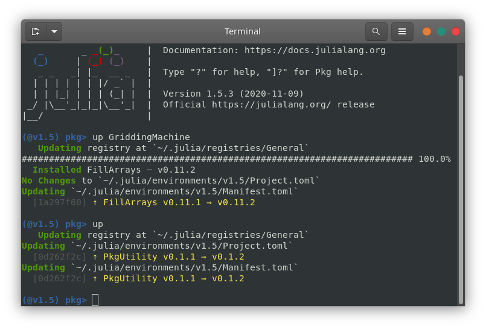

# METHODS

## GriddingMachine.jl

Preparation
- Julia (version 1.5+)
- Access to Github
- Access to ftp://fluo.gps.caltech.edu (to download data)

### Install GriddingMachine.jl
- Start Julia REPL (read-eval-print loop)
  
- Type `]` in the REPL, and goes to `pkg` environment
  
- Type `add GriddingMachine`
  
- Type `Backspace` to go back to Julia REPL
  

### Use GriddingMachine.jl
- Type `using GriddingMachine` in Julia REPL
  
- `lnc_lut = load_LUT(LNCButler{Float32}());`
- `read_LUT(lnc_lut, Float32(30), Float32(-100))`
  
- Be aware that provided lat and lon need to be the same float type as the dataset, either Float32 or Float64

### Upgrade GriddingMachine.jl
- Start Julia REPL (read-eval-print loop)
- Type `]` in the REPL, and goes to `pkg` environment
- Type `up` to upgrade all Julia packages
- Type `up GriddingMachine` to upgrade GriddingMachine only
  

## Relative leaf water content

Equipments and materials required:
- Plastic zip bags
- Oven proof envelopes
- Scissors
- Paper towel or (toliet) paper roll
- Balance (0.0001-0.001 g precision)

### Steps to measure RLWC (easiest)
- Prepare zip bags with wet paper inside
- Abscise leaf from the junction of leaf blade and leaf petiole
- Put leaf into a zip bag with wet paper and mark the leaf samples
- Bring leaf samples back to lab
- Clean leaf blade with dry paper and measure leaf wet weight (WW)
- Rehydrate leaf samples in water for 3-4 hours at room light and temperature
- Measure rehydrated leaf weight (RW)
- Measure pre-marked oven safe envelope weight (EW)
- Put leaf sample in the envelope and dry the leaf samples at 80 Celcius for 24 hours
- Measure envelope+leaf weight (TW)
- Leaf dry weight, DW = TW - EW
- Relative leaf water content, RLWC = (WW - DW) / (RW - DW)

### Steps to measure RLWC (more accurate)
- Prepare zip bags with wet paper inside
- Abscise leaf from the junction of leaf blade and leaf petiole
- Put leaf into a zip bag with wet paper and mark the leaf samples
- Bring leaf samples back to lab
- Clean leaf blade with dry paper
- Abscise leaf into big pieces (avoid major vein) for better rehydration
- Measure wet weight of leaf pieces (WW)
- Rehydrate leaf samples in water for 3-4 hours at room light and temperature
- Measure rehydrated weight of leaf pieces (RW)
- Measure pre-marked oven safe envelope weight (EW)
- Put leaf sample in the envelope and dry the leaf samples at 80 Celcius for 24 hours
- Measure envelope+leaf weight (TW)
- Leaf dry weight, DW = TW - EW
- Relative leaf water content, RLWC = (WW - DW) / (RW - DW)
